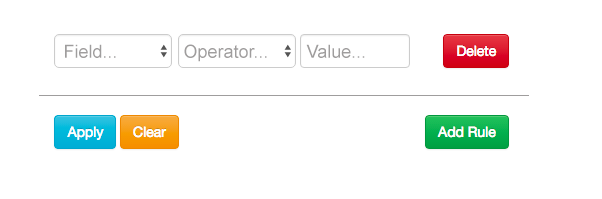

<h1 align="center">Тестовое задание PHP+JS+HTML</h1>

Страница для поиска репозиториев на GitHub: можно задать одно или несколько правил и получить список репозиториев, удовлетворяющих этим правилам.

## 1. HTML + JS

<b>Поля:</b> 
<b>Field</b> - выпадающий список (size, forks, stars, followers) 
<b>Operator</b> - выпадающий список - операторы больше, меньше, равно.  
<b>Value</b> - значение, целое число 
 
При нажатии <b>delete</b> правило удаляется  
При нажатии <b>Clear</b> все правила удаляются, и добавляется одно пустое правило. 
При нажатии <b>Add Rule</b> добавляется пустое правило в конец. 
При нажатии <b>Apply</b> правила в <b>JSON</b> отправляются на сервер. 

## 2.PHP 

На сервере PHP скрипт формирует запрос к GitHub Search API <a href="https://developer.github.com/v3/search/#search-repositories">https://developer.github.com/v3/search/#search-repositories</a> и выдает страницу с списком репозиториев, удовлетворяющих условиям. Для каждого репозитория должно выводиться его название (со ссылкой на репозиторий), размер, число форков, followers и звезд.
